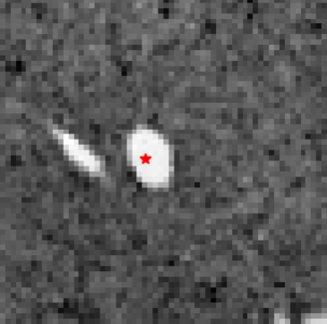
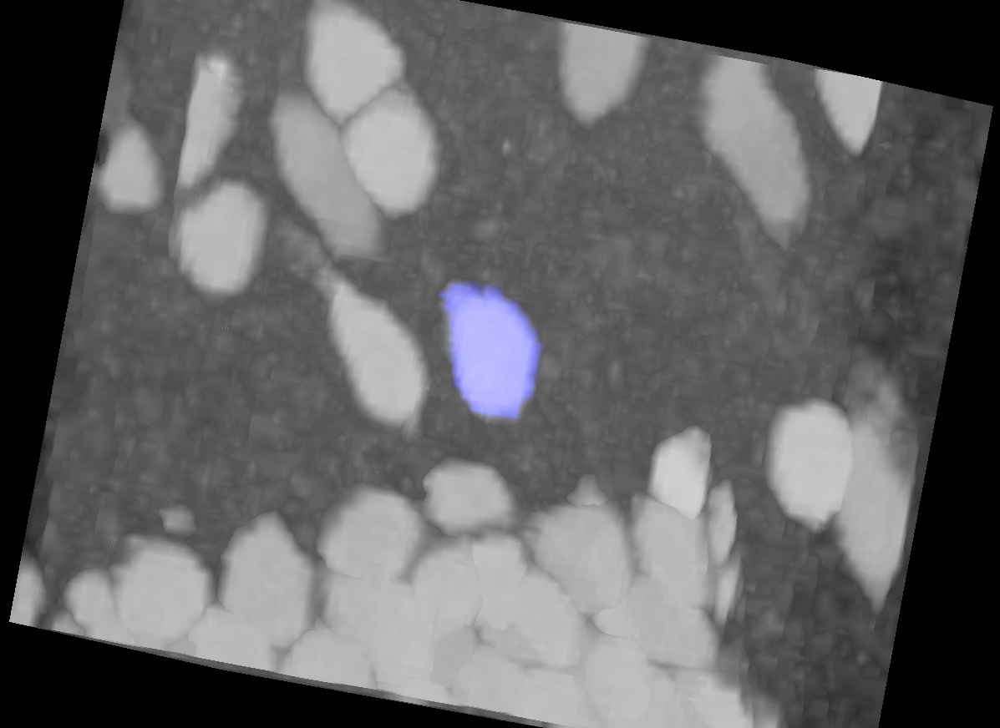

# **Adapt SAM2 3D: Segment Anything 2.1 for 3D Object Annotation**

Segment Anything Model 2 (SAM2) is a foundation model designed for **promptable visual segmentation** in images and videos. SAM2 2 introduced **object tracking through time** using a streaming memory mechanism. This process can be used to find 3D object by considering 2D slices of volumetric images as video frames.

This repository provides a **simple and efficient** way to perform **3D volume estimation** using SAM2.

<div style="display: flex; align-items: center;">
    
    <div style="width: 200px; text-align: center; font-size: 4em;">&#8594;</div>
    
</div>

---

## 🚀 Installation

### 1️⃣ Install SAM2

```sh
git clone https://github.com/facebookresearch/sam2
cd sam2
pip install .
```

### 2️⃣ Install AdaptSAM-3D

```sh
git clone https://github.com/KarpRom/adaptSAM-3D
cd adaptSAM-3D
pip install .
```

---

## ⚡ Quickstart

First make sure you have pretrained weights from sam2.1.
You can use the script in `checkpoints/download_ckpts.sh` to download them.

Want to try **AdaptSAM 3D** immediately? Here's a minimal example:

```python
import sam2
import tifffile as tif
from adaptsam import AdaptSAMPredictor

# Load the SAM2 predictor
predictor = AdaptSAMPredictor(
    model_cfg="configs/sam2.1/sam2.1_hiera_b+.yaml",
    sam2_checkpoint="checkpoints/sam2.1_hiera_b+.pt"
)

# Load a 3D image
mat = tif.imread("example/data/img_0000_0576_0768.tif")

# Define a point prompt (x, y, z)
point_prompt = [10, 20, 30]

# Generate the prediction
prediction = predictor.predict(mat, point_prompt)

# Save the result
tif.imwrite("predicted.tif", prediction)
```

Or you can take a look at the [example](/example/cell_segmentation.ipynb)

---

## Finetuning Sam

TBD

---

## Roadmap

- [ ] Support multiple point prompt
- [ ] Support positive and negative point prompt
- [ ] Support bounding box prompt
- [ ] Support mask prompt

---

## ❗ Troubleshooting

- **No space left when installing SAM2?**  
  Set the `TMPDIR` environment variable to another location before installing:
  ```sh
  TMPDIR=<path> pip install .e
  ```

## Support

You can reach out to me here: romain.karpinski@loria.fr
